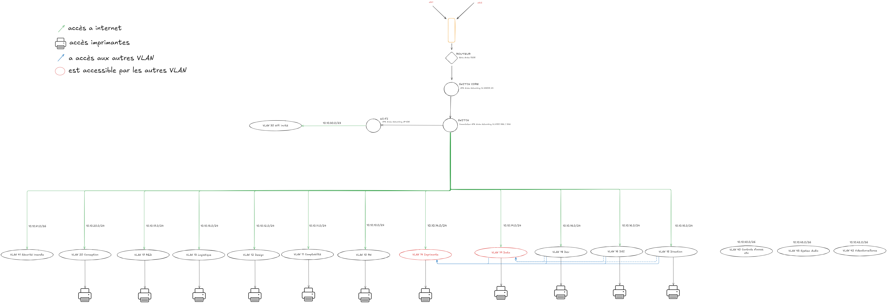
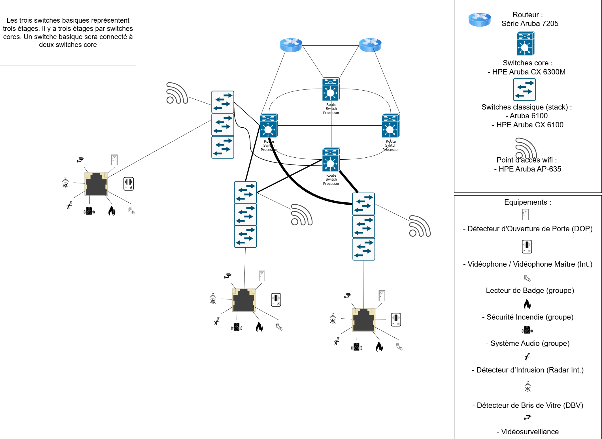

# Sommaire
1. [Introduction](##1.introduction)  
2. [Architecture réseau proposée](##2.architecture-réseau-proposée)  
    2.1. [Schéma de l'architecture réseau](###2.1.schéma-de-larchitecture-réseau)  
    2.2. [Choix des équipements](###2.2.choix-des-équipements)  
3. [Plan d'adressage IP](##3.plan-dadressage-ip)  
4. [Matrice des flux](##4.matrice-des-flux)  
5. [DPGF](##5.DPGF)  
6. [Récapitulatif](##6.récapitulatif)  
7. [Ressources et liens](##7.ressources-et-liens)  
8. [Conclusion](##8.conclusion)

---
## 1. Introduction
Ce mémoire présente la conception et la mise en place d'une architecture réseau pour une entreprise, visant à fournir une infrastructure fiable, évolutive et sécurisée. L'objectif est de répondre aux besoins actuels tout en anticipant la croissance future de l'organisation, avec un accent particulier sur la gestion de la performance, la sécurité et la facilité d'administration.

---
## 2. Architecture réseau proposée
### 2.1 Schéma de l'architecture réseau
**Schéma logique :**
Notre schéma logique ci-dessous permet de mieux comprendre l’organisation des différents **VLAN** dans le réseau et la manière dont ces derniers sont **interconnectés**.  
Ce schéma aide également à analyser le **flux de données** entre les VLAN et à évaluer les **relations** entre eux, notamment en termes de **sécurité** et d’**accessibilité**.  
Les **routes configurées** entre les VLAN via le **routeur** ou le **commutateur de niveau 3** sont essentielles pour garantir une **communication fluide** tout en maintenant l’**isolation nécessaire**.

En résumé, l’objectif principal de ce schéma est d’offrir une vue d’ensemble claire de l’organisation logique du réseau, facilitant ainsi son diagnostic et son évolution. Il peut également servir à identifier les points potentiels de congestion ou de vulnérabilité.

---
**Schéma physique :**
L'objectif principal de ce schéma est de fournir une vue d'ensemble des **connexions physiques entre les équipements réseau, les points d'accès, et les dispositifs de sécurité ou de communication**. Cela facilite la compréhension du fonctionnement et de la manière dont les différents étages sont interconnectés.

En résumé, ce schéma offre une vue claire de l’organisation et de l’interconnexion des équipements dans un bâtiment. Il met en avant une architecture bien pensée, axée sur la redondance, la sécurité et la performance, tout en restant évolutive pour répondre aux besoins futurs.

---
### 2.2 Choix des équipements
Les équipements proposés sont sélectionnés pour répondre aux besoins de performance, de sécurité et d'évolutivité de l'entreprise. Voici un détail des choix effectués pour chaque catégorie d'équipement.
### 1) Choix des équipements
Nous avons choisi quatre catégories d'équipements pour cette infrastructure réseau :
- #### **Bornes Réseaux**  
	- Le modèle choisi est le **HPE Aruba Networking AP-635 (US) Tri Radio 2x2 802.11ax Wi-Fi 6E Internal Antennas Campus AP**. Cette borne Wi-Fi 6E est idéale pour une couverture complète sur les bandes 2,4 GHz, 5 GHz et 6 GHz, permettant un débit maximal de 3,9 Gbps. Cela permet à l'entreprise de répondre aux besoins actuels tout en planifiant la croissance future.  
-  **Caractéristiques clés** :  
	- Support des bandes 2,4 GHz, 5 GHz et 6 GHz  
	- Débit maximal de 3,9 Gbps  
	- Jusqu’à sept canaux de 160 MHz pour des performances optimisées  
	- Filtrage ultra tri-bande pour éviter les interférences  
	- Double port de basculement pour Ethernet et alimentation  
- **[Datasheet du HPE Aruba Networking AP-635](https://www.hpe.com/psnow/doc/PSN1013609539CZEN)**

- #### **Routeur**  
	- Le routeur choisi est l’**Aruba 7205**, qui permet de prendre en charge jusqu'à 256 points d'accès et plus de 8000 appareils. Ce modèle offre de hautes performances de connectivité Wi-Fi 6, ce qui le rend parfaitement adapté à l’entreprise.  
- **Caractéristiques clés** :  
	- Prise en charge de 256 points d'accès et 8000 appareils  
	- Connectivité Wi-Fi 6  
- **[Datasheet du Aruba 7205](https://www.hpe.com/psnow/doc/a00059060enw)**

- #### **Switch core**  
	- Nous avons opté pour le **HPE Aruba Networking CX 6300M 24-port SFP+ and 4-port SFP56 Switch**, un switch modulaire de couche 3 avec des capacités avancées (BGP, EVPN, VXLAN, OSPF, VRF). Ce modèle est conçu pour une haute performance avec un débit maximal de 880 Gbit/s. 
- **Caractéristiques clés** :  
	  - Commutation haute performance avec un débit maximal de 880 Gbit/s
	  - Modules d'alimentation redondants pour plus de sécurité  
- **[Datasheet du HPE Aruba Networking CX 6300M](https://www.hpe.com/psnow/doc/PSN1012183959BEFR.pdf?jumpid=in_pdp-psnow-dds)**

- #### **Switch standard**  
  Nous avons sélectionné deux modèles pour les switches standards :  
  - **Commutateur Aruba 6100 24G Classe 4 PoE 4SFP+ 370 W** :  
    Ce modèle offre 24 ports et une capacité de 370 W de PoE, avec une bande passante de 128 Gbps.  
- **[Datasheet du Aruba 6100](https://www.hpe.com/psnow/doc/PSN1013152645FRFR)**

  - **Commutateur HPE Aruba Networking CX 6100 48G Classe 4 PoE 4SFP+ 740 W** :  
    Il dispose de 48 ports, fournit 740 W de PoE et peut gérer une bande passante de 176 Gbps.  
- **[Datasheet du HPE Aruba Networking CX 6100](https://www.hpe.com/psnow/doc/PSN1014739204BEFR.pdf?jumpid=in_pdppsnow-dds)**

### 2) Gestion des switchs par étages
Pour chaque étage, les besoins en PoE (Power over Ethernet) et en bande passante ont été calculés en prenant en compte une augmentation de 30 % pour garantir une capacité suffisante en cas de croissance. De plus, le nombre de ports nécessaires a été ajusté pour inclure cette marge, permettant d’anticiper l’ajout d’équipements futurs. Voici la configuration de chaque étage avec les switches associés :

| **Étage**  | **Total appareils** | **Total PoE** | **Total bande passante** |                                                                  **Switchs** |
| :--------: | :-----------------: | ------------: | :----------------------: | ---------------------------------------------------------------------------: |
| Sous-sol 5 |         20          |       106,6 W |       10,1543 Gb/s       |                       1 x **Aruba 6100 24G** (24 Ports, 370 W PoE, 128 Gbps) |
| Sous-sol 4 |         29          |       152,1 W |       10,166 Gb/s        |                          1 x **CX 6100 48G** (48 Ports, 740 W PoE, 176 Gbps) |
| Sous-sol 3 |         39          |       140,4 W |        5,126 Gb/s        |                          1 x **CX 6100 48G** (48 Ports, 740 W PoE, 176 Gbps) |
| Sous-sol 2 |         46          |       269,1 W |       20,347 Gb/s        |                          1 x **CX 6100 48G** (48 Ports, 740 W PoE, 176 Gbps) |
| Sous-sol 1 |         110         |         372 W |       0,20683 Gb/s       | 2 x **CX 6100 48G** (48 Ports, 740 W PoE, 176 Gbps) + 1 x **Aruba 6100 24G** |
|    RDC     |         166         |       1085,5W |       30,746 Gb/s        |                                 3 x **CX 6100 48G** + 1 x **Aruba 6100 24G** |
|  Étage 1   |         91          |         686 W |       60,987 Gb/s        |                          2 x **CX 6100 48G** (48 Ports, 740 W PoE, 176 Gbps) |
|  Étage 2   |         107         |         688 W |       60,892 Gb/s        | 2 x **CX 6100 48G** (48 Ports, 740 W PoE, 176 Gbps) + 1 x **Aruba 6100 24G** |
|  Étage 3   |         106         |         689 W |       60,890 Gb/s        | 2 x **CX 6100 48G** (48 Ports, 740 W PoE, 176 Gbps) + 1 x **Aruba 6100 24G** |
|  Étage 4   |         107         |         692 W |       60,892 Gb/s        | 2 x **CX 6100 48G** (48 Ports, 740 W PoE, 176 Gbps) + 1 x **Aruba 6100 24G** |
|  Étage 5   |         97          |       660,4 W |       60,883 Gb/s        | 2 x **CX 6100 48G** (48 Ports, 740 W PoE, 176 Gbps) + 1 x **Aruba 6100 24G** |
|  Étage 6   |         62          |         585 W |       60,921 Gb/s        | 1 x **CX 6100 48G** (48 Ports, 740 W PoE, 176 Gbps) + 1 x **Aruba 6100 24G** |

---
## 3. Plan d'adressage IP
### Plan d'adressage hiérarchisé

| **VLAN**              | **Numéro de VLAN** | **Réseau IP** | **Masque** | **Passerelle par défaut** | **Nb max d'appareils** | **Nb appareils actuels** |
| --------------------- | ------------------ | ------------- | ---------- | ------------------------- | ---------------------- | ------------------------ |
| **RH**                | 1                  | 10.10.10.0    | /24        | 10.10.10.1                | 254                    | 150                      |
| **Comptabilité**      | 80                 | 10.10.11.0    | /24        | 10.10.11.1                | 254                    | 120                      |
| **Design**            | 90                 | 10.10.12.0    | /23        | 10.10.12.1                | 510                    | 80                       |
| **Logistique**        | 100                | 10.10.14.0    | /23        | 10.10.14.1                | 510                    | 100                      |
| **Imprimantes**       | 60                 | 10.10.16.0    | /25        | 10.10.16.1                | 126                    | 50                       |
| **Direction**         | 10                 | 10.10.17.0    | /25        | 10.10.17.1                | 126                    | 40                       |
| **DSI**               | 20                 | 10.10.18.0    | /24        | 10.10.18.1                | 254                    | 180                      |
| **R&D**               | 110                | 10.10.19.0    | /23        | 10.10.19.1                | 510                    | 160                      |
| **Dev**               | 30                 | 10.10.21.0    | /24        | 10.10.21.1                | 254                    | 200                      |
| **Data**              | 50                 | 10.10.22.0    | /24        | 10.10.22.1                | 254                    | 190                      |
| **Conception**        | 120                | 10.10.23.0    | /25        | 10.10.23.1                | 126                    | 60                       |
| **Invités Wi-Fi**     | 140                | 10.10.24.0    | /22        | 10.10.24.1                | 1022                   | 600                      |
| **Contrôle d'accès**  | 130                | 10.10.28.0    | /25        | 10.10.28.1                | 126                    | 90                       |
| **Sécurité Incendie** | 150                | 10.10.29.0    | /22        | 10.10.29.1                | 1022                   | 529                      |
| **Vidéosurveillance** | 160                | 10.10.31.0    | /25        | 10.10.31.1                | 126                    | 22                       |
| **Système audio**     | 170                | 10.10.33.0    | /26        | 10.10.33.1                | 62                     | 35                       |

Le plan d'adressage IP de l'entreprise est conçu de manière hiérarchique, pour une gestion optimale du réseau. Il a été mis en place en prenant en compte les besoins spécifiques de chaque service, les équipements actuels, ainsi que la capacité de croissance pour chaque département. L'objectif est d'assurer une isolation adéquate des différents services tout en permettant une expansion fluide dans le temps.

#### Justification des choix d’adressage
1. **VLANs administratifs (RH, Comptabilité, etc.)**  
    Le masque /24 permet d’attribuer jusqu’à 254 adresses IP pour chaque service. Ce masque est adapté à la taille des services administratifs tels que les **Ressources Humaines (RH)** et **Comptabilité**, qui comptent respectivement 150 et 120 appareils. En moyenne, les services administratifs dans une entreprise de taille moyenne à grande sont constitués d'environ 100 à 150 employés, ce qui justifie l'attribution de 254 adresses pour chaque département. Ce masque permet également de prendre en compte une marge de croissance pour l'ajout d'utilisateurs, de nouveaux équipements ou de la connectivité mobile dans le futur.
    
2. **VLANs pour des départements plus larges (Design, Logistique, R&D)**  
    Les départements comme **Design**, **Logistique**, et **R&D** sont souvent plus grands ou nécessitent plus de périphériques partagés (stations de travail, imprimantes, etc.). Par exemple, le service **R&D** compte actuellement 160 appareils, et les VLANs pour ces services sont donc dimensionnés avec un masque /23, permettant un maximum de 510 adresses. Ce choix permet de répondre aux besoins immédiats tout en garantissant une réserve suffisante pour accueillir de nouveaux appareils à mesure que l’entreprise se développe. De plus, le service **Design**, avec une taille de 80 appareils, bénéficie également de cette plage d’adresses plus large, en prévision d'une évolution rapide du service.
    
3. **VLANs techniques et spécialisés (Imprimantes, Système audio, Vidéosurveillance)**  
    Les services nécessitant des équipements spécifiques, comme les **Imprimantes** ou le **Système audio**, utilisent des masques plus petits, comme /25 (126 adresses) ou /26 (62 adresses), car ces départements nécessitent un nombre limité d'adresses. Par exemple, pour les **Imprimantes**, avec 50 appareils connectés, un masque /25 offre une capacité de 126 adresses, suffisante pour l'expansion future des équipements. Pour le **Système audio**, un masque /26, qui correspond à 62 adresses, est adapté aux 35 appareils actuels tout en garantissant une marge pour des ajouts futurs. De même, la **Vidéosurveillance**, avec seulement 22 appareils, utilise un masque /25 qui couvre 126 adresses, anticipant l’ajout de nouvelles caméras de sécurité au fil du temps.
    
4. **Services critiques et d’infrastructure (Sécurité Incendie, Contrôle d'accès)**  
    Les services critiques tels que la **Sécurité Incendie** et le **Contrôle d'accès** nécessitent des VLANs avec une large plage d'adresses pour couvrir un grand nombre d'appareils. Par exemple, pour la **Sécurité Incendie**, avec 529 appareils actuels (détecteurs, alarmes, etc.), un masque /22 a été choisi, offrant une capacité de 1022 adresses, permettant de prévoir l'ajout de nouveaux appareils dans les années à venir. Pour le **Contrôle d'accès**, qui compte actuellement 90 appareils, un masque /25 est suffisant, fournissant 126 adresses pour couvrir les besoins immédiats et futurs.
    
5. **Réseau Wi-Fi Invités**  
    Le **Réseau Wi-Fi Invités** justifie l'attribution d'un masque /22, permettant 1022 adresses, car une entreprise accueille souvent un grand nombre de visiteurs et d'appareils connectés temporairement. Actuellement, 600 appareils sont connectés au réseau Wi-Fi des invités, et le masque /22 offre une grande flexibilité pour gérer cette demande. Cette plage d'adresses garantit que le réseau Wi-Fi restera opérationnel même en cas de forte demande, tout en préservant une sécurité renforcée grâce à l'isolement de ce VLAN des autres services internes.
#### Avantages de ce plan d’adressage
1. **Sécurité renforcée :** Chaque département et service est isolé dans un VLAN dédié, réduisant ainsi les risques d’accès non autorisé. Cette segmentation est particulièrement importante pour les services sensibles comme la sécurité incendie, les systèmes de contrôle d'accès et la vidéosurveillance, qui sont isolés pour garantir leur intégrité.
2. **Optimisation des ressources :** Le choix des masques a été effectué de manière à maximiser l’utilisation des adresses IP tout en laissant une marge pour la croissance. Les VLANs sont dimensionnés de façon optimale, minimisant le gaspillage d’adresses IP et assurant une gestion efficace des ressources réseau.
3. **Scalabilité :** La structure hiérarchique du plan d’adressage permet une évolution fluide de l’infrastructure. Le réseau peut facilement être étendu à mesure que l’entreprise se développe, qu’il s’agisse d’ajouter de nouveaux employés ou d’intégrer des équipements supplémentaires, comme des dispositifs IoT ou des stations de travail supplémentaires dans les départements techniques.
4. **Gestion simplifiée :** La clarté du plan d’adressage facilite la gestion et le dépannage du réseau. L’administration des VLANs et des plages IP par département permet une surveillance facile et rapide des ressources réseau, et assure une gestion plus efficace des incidents en cas de besoin.

---
## 4. Matrice des flux
La matrice des flux définit les règles de communication entre les VLANs en fonction des besoins métiers. 

| **VLAN**                                                 | **Accès à Internet** | **Est accessible par les autres VLAN** | **A accès aux autres VLAN** | **Accès imprimantes** |
| -------------------------------------------------------- | -------------------- | -------------------------------------- | --------------------------- | --------------------- |
| **RH**                                                   | Oui                  | Non                                    | Non                         | Oui                   |
| **Comptabilité**                                         | Oui                  | Non                                    | Non                         | Oui                   |
| **Design**                                               | Oui                  | Non                                    | Non                         | Oui                   |
| **Logistique**                                           | Oui                  | Non                                    | Non                         | Oui                   |
| **Imprimantes**                                          | Oui                  | Oui                                    | Non                         | Oui                   |
| **Direction**                                            | Oui                  | Non                                    | Oui                         | Oui                   |
| **DSI**                                                  | Oui                  | Non                                    | Oui                         | Oui                   |
| **R&D**                                                  | Oui                  | Non                                    | Non                         | Oui                   |
| **Dev**                                                  | Oui                  | Non                                    | Oui                         | Oui                   |
| **Data**                                                 | Oui                  | Oui                                    | Oui                         | Oui                   |
| **Conception**                                           | Oui                  | Non                                    | Non                         | Oui                   |
| **Invités Wi-Fi**                                        | Oui                  | Non                                    | Non                         | Non                   |
| **Contrôle d'accès, Détection intrusion et vidéophonie** | Non                  | Non                                    | Non                         | Non                   |
| **Sécurité Incendie**                                    | Oui                  | Oui                                    | Oui                         | Non                   |

---
## 5. DPGF
### Détail des Équipements et Coûts

| **Désignation**                           | **Référence** | **Quantité** | **Prix Unitaire** | **Total avant FG** | **Total avec FG (35%)** |
| ----------------------------------------- | ------------- | ------------ | ----------------: | -----------------: | ----------------------: |
| **Switch cœur de réseau**                 | JL658A        | 4            |        8 038,80 € |        32 155,20 € |             43 409,52 € |
| **Switch de distribution (grand)**        | R9Y04A        | 19           |        3 214,80 € |        61 081,20 € |             82 459,62 € |
| **Switch de distribution (petit)**        | JL677A        | 8            |        1 405,20 € |        11 241,60 € |             15 176,16 € |
| **Licences Switch cœur de réseau**        | HR4C2E        | 4            |        1 024,80 € |         4 099,20 € |              5 533,92 € |
| **Licences Switchs (grand)**              | H83A5E        | 19           |          479,60 € |         9 112,40 € |             12 301,74 € |
| **Licences Switchs (petit)**              | HV1M2E        | 8            |          201,60 € |         1 612,80 € |              2 177,28 € |
| **Configuration Switchs cœur de réseau**  |               | 4            |           20,00 € |            80,00 € |                108,00 € |
| **Configuration Switchs de distribution** |               | 27           |           40,00 € |         1 080,00 € |              1 458,00 € |
| **Bornes Wi-Fi 6E**                       | R7J27A        | 87           |          632,80 € |        55 053,60 € |             74 322,36 € |
| **Licences Bornes Wi-Fi**                 | H29YFE        | 87           |           77,60 € |         6 751,20 € |              9 114,12 € |
### Total Général
**Total après application des frais généraux (35%) :** **246 060,72 €**

---
## 6. Récapitulatif
>[!note] Récapitulatif de l'architecture réseau proposée
>#### Schéma logique :  
>**Éléments clés du schéma :**  
>**Routeur principal :**  
>- Un routeur de la série Aruba 7205 agit comme passerelle entre le réseau interne et l'extérieur (Internet).  
>- Il est également responsable de gérer le routage inter-VLAN lorsque cela est nécessaire.  
>  
>**Switch Core :**  
>- Le switch principal (core) de modèle HPE Aruba CX 6300M centralise les connexions réseau des VLAN.  
>- Il est le point névralgique qui interconnecte les switches secondaires (access switches) et assure la gestion du trafic interne.  
>  
>**Switch d’accès :**  
>- Les switches d’accès connectent les VLAN individuels au switch core et permettent la segmentation logique du réseau au niveau des sous-réseaux.  
>  
>**Les VLAN et leurs segments :**  
>- Chaque VLAN représente un sous-réseau avec une plage d’adresses IP spécifique. Voici quelques exemples des VLAN définis :  
>  - **VLAN 01 - Sécurité Incendie (10.0.41.0/26)** : Réservé aux équipements liés à la gestion des incendies.  
>  - **VLAN 10 - RH (10.0.11.0/24)** : Dédié au département des ressources humaines.  
>  - **VLAN 12 - Design (10.0.12.0/24)** : Destiné aux équipes de conception.  
>  - **VLAN 15 - Direction (10.0.15.0/24)** : Spécifique à la direction.  
>  - **VLAN 20 - Conception (10.10.20.0/24)** : Regroupe les services de conception avancée.  
>  - **VLAN 19 - Data (10.0.19.0/24)** : Centralise les données critiques et est marqué en rouge pour souligner son importance stratégique.  
>  
>**Connexion à Internet et inter-VLAN :**  
>- Les flèches vertes indiquent les VLAN qui ont un accès direct à Internet.  
>- Les flèches bleues montrent les connexions entre certains VLAN. Par exemple, le **VLAN 14 - Informatique (10.0.14.0/24)** est interconnecté avec d’autres VLAN (en bleu), probablement pour gérer les infrastructures réseau ou fournir des services aux autres départements.  
>- Les cercles rouges marquent les VLAN qui sont accessibles depuis d’autres VLAN (par exemple, pour les imprimantes ou les partages de fichiers).  
>  
>**Légende et symboles :**  
>- Les différents types d’accès sont distingués grâce à un code couleur et des flèches directionnelles :  
>  - **Flèche verte** : Accès Internet.  
>  - **Flèche noire** : Accès aux imprimantes ou équipements partagés.  
>  - **Flèche bleue** : Accès inter-VLAN pour certains services.  
>  
>**Méthodologie de conception :**  
>**Segmentation logique via les VLAN :**  
>- La segmentation en VLAN permet d'isoler les différents départements ou services (par exemple, RH, Direction, Informatique) afin de limiter les risques de propagation des menaces (cyberattaques ou problèmes réseau).  
>- Chaque VLAN est associé à un sous-réseau IP distinct, ce qui simplifie la gestion des adresses IP et permet une identification claire du trafic.  
>  
>**Sécurité renforcée :**  
>- Certains VLAN sont isolés des autres (pas d'interconnexion) pour protéger les informations sensibles.  
>- Par exemple, les VLAN liés à la sécurité incendie ou à la vidéosurveillance sont isolés pour limiter tout accès non autorisé.  
>- Le routage inter-VLAN est contrôlé par le routeur principal, permettant de définir des règles de pare-feu précises.  
>  
>**Performance et priorisation :**  
>- Le réseau est conçu pour assurer une haute performance, en particulier pour les VLAN critiques (comme le VLAN Data), grâce à une hiérarchie claire entre les switches d’accès et le switch core.  
>- Les VLAN ayant besoin d’un accès internet direct (par exemple, pour la navigation ou les services cloud) sont connectés au routeur via des règles spéciales.  
>  
>**Évolutivité et maintenance :**  
>- Ce design modulaire basé sur les VLAN permet une grande évolutivité.  
>- Si de nouveaux départements ou services sont ajoutés, de nouveaux VLAN peuvent être facilement intégrés sans impacter les autres.  
>- La séparation logique simplifie la gestion et la maintenance. Par exemple, un problème dans un VLAN n'affectera pas les autres.  
>  
>**Centralisation des ressources partagées :**  
>- Les équipements partagés (comme les imprimantes ou les serveurs) sont placés dans des VLAN accessibles par plusieurs autres VLAN, mais toujours de manière contrôlée et sécurisée.  
>  
>**Avantages du design logique :**  
>- **Isolation des services sensibles** : Les données critiques ou les systèmes de sécurité ne sont accessibles que par des VLAN spécifiques, réduisant les risques de compromission.  
>- **Gestion simplifiée** : La centralisation des flux via le switch core et le routage par le routeur principal offre une visibilité et un contrôle optimal sur le réseau.  
>- **Flexibilité** : Ce design permet de modifier ou d'ajouter des VLAN sans restructurer entièrement le réseau.  
>- **Sécurité renforcée** : En limitant les accès inter-VLAN et en isolant certains segments, les risques de cyberattaques ou d'accès non autorisés sont réduits.  

>[!note] Récapitulatif de l'architecture réseau proposée
>#### Schéma physique :
> **Éléments principaux :**  
> **Équipements réseau utilisés :**  
> - **Routeur Aruba série 7205** : Permet de gérer le routage et la connexion à l'extérieur du réseau.  
> - **Switches core HPE Aruba CX 6300M** : Ces switches principaux jouent un rôle de cœur de réseau (core). Ils assurent une redondance et une haute disponibilité des connexions réseau en desservant les switches des étages.  
> - **Switches classiques Aruba 6100 (en stack)** : Ces switches sont utilisés pour connecter localement les équipements d'un étage spécifique, permettant une interconnexion avec les switches core.  
> - **Points d’accès Wifi HPE Aruba AP-635** : Permettent une couverture sans fil optimale pour chaque étage.  
>  
> **Équipements fonctionnels et de sécurité :**  
> - **Détecteurs d'ouverture de porte (DOP)** : Permettent de surveiller l'accès aux pièces critiques.  
> - **Vidéophones/Vidéophones maîtres internes** : Assurent une communication audiovisuelle entre les étages ou avec un poste central.  
> - **Lecteurs de badge (contrôle d'accès)** : Utilisés pour sécuriser les accès aux zones sensibles.  
> - **Systèmes de sécurité incendie (groupés)** : Systèmes de détection d'incendie connectés pour assurer la sécurité.  
> - **Système audio (groupé)** : Permet la diffusion d'annonces ou d'alarmes.  
> - **Détecteurs d'intrusion (radar interne)** : Protéger contre les intrusions.  
> - **Détecteurs de bris de vitre (DBV)** : Détectent les tentatives d'effraction.  
> - **Caméras de vidéosurveillance** : Pour la surveillance visuelle des lieux.  
>  
> **Logique et méthodologie de conception :**  
> **Organisation par étage :**  
> - Chaque étage est équipé d'un switch classique qui connecte tous les équipements locaux (détecteurs, caméras, points d'accès Wifi, etc.).  
> - Les switches classiques sont regroupés dans une configuration stackée pour simplifier leur gestion et améliorer leur performance. Cela garantit également une redondance en cas de défaillance d'un switch unique.  
>  
> **Connexion au réseau principal (core) :**  
> - Chaque switch d'étage est connecté à deux switches core HPE Aruba CX 6300M, suivant une logique de double attachement pour garantir une résilience en cas de panne de l'un des core switches.  
> - Les core switches servent de nœuds centraux qui centralisent le trafic venant des trois étages et le routent vers le routeur principal (Aruba série 7205).  
>  
> **Distribution Wifi :**  
> - Les points d’accès Wifi (AP) sont stratégiquement positionnés pour fournir une couverture homogène dans le bâtiment. Ces AP sont directement connectés aux switches de leur étage.  
>  
> **Sécurité et communication :**  
> - Les équipements de sécurité (détecteurs, caméras, etc.) et de communication (vidéophones) sont répartis par étage et sont connectés aux switches locaux.  
> - Les dispositifs groupés, comme les systèmes audio et de sécurité incendie, utilisent une infrastructure dédiée mais intégrée à l’architecture réseau via les switches.  
>  
> **Objectifs de conception atteints :**  
> - **Fiabilité et disponibilité** : La redondance des core switches et la connexion en stack des switches classiques assurent une disponibilité constante du réseau, même en cas de panne partielle.  
> - **Modularité** : Chaque étage dispose de son propre switch, ce qui facilite la maintenance et l'extension future de l'infrastructure.  
> - **Sécurité intégrée** : L’intégration des systèmes de sécurité (intrusion, incendie, vidéosurveillance) au réseau permet une surveillance centralisée et une réponse rapide aux incidents.  
> - **Performance** : L’utilisation de switches de haute performance (HPE Aruba CX 6300M) assure un réseau rapide et fiable, même sous une forte charge.  

> [!note] Récapitulatif du choix des équipements
L’architecture réseau a été pensée pour garantir une performance optimale, une sécurité accrue et une évolutivité adaptée à la croissance de votre entreprise. Voici un aperçu des principaux équipements sélectionnés et les raisons de leur choix :
> - **Bornes Wi-Fi**  
>     Le **HPE Aruba AP-635 Wi-Fi 6E** a été choisi pour sa capacité tri-bande, incluant la bande 6 GHz, offrant une couverture étendue et un débit pouvant atteindre 3,9 Gbps. Ces bornes sont idéales pour des environnements avec une forte densité d’utilisateurs, assurant une connectivité rapide et fiable.
>     
> - **Routeur**  
>     L’**Aruba 7205** a été retenu pour sa robustesse et sa capacité à gérer un grand nombre de connexions (jusqu’à 256 points d’accès et 8000 appareils). Il offre une disponibilité élevée, garantissant la stabilité de l’ensemble du réseau.
>     
> - **Switch Core**  
>     Le **HPE Aruba Networking CX 6300M**, un switch modulaire de couche 3, a été sélectionné pour sa capacité exceptionnelle (débit de 880 Gbps) et ses fonctionnalités avancées. Il est conçu pour des applications critiques et une continuité de service assurée.
>     
> - **Switchs par étages**  
>     Les **Aruba CX 6100** sont utilisés pour répondre aux besoins spécifiques des étages. Ces équipements, compatibles PoE, fournissent une alimentation fiable aux appareils connectés et un débit stable, tout en intégrant une marge de 30 % pour anticiper une croissance future.
>     
> 
> ### Gestion des ressources
> Les équipements réseau ont été répartis stratégiquement, avec une gestion par étage intégrant des réserves de capacité en bande passante et alimentation PoE. Ce dimensionnement garantit la flexibilité nécessaire pour répondre aux besoins actuels et futurs, tout en optimisant les coûts.
> 
> En résumé, cette sélection d’équipements et de technologies assure une infrastructure réseau performante, évolutive et sécurisée, en phase avec les ambitions et les besoins spécifiques de votre entreprise.

---

 > [!note] **Récapitulatif pour le plan d’adressage IP**
> Le plan d’adressage IP hiérarchisé a été conçu pour répondre aux besoins actuels des différents départements tout en anticipant une croissance future.
> 
> - **VLANs administratifs (RH, Comptabilité, etc.)** :  
>     Chaque service est isolé dans un VLAN avec un masque **/24 (254 adresses)**, adapté à la taille moyenne des départements d’une entreprise typique. Par exemple, le service RH compte 150 appareils sur une plage prévue pour 254, correspondant à une estimation réaliste basée sur les proportions moyennes des effectifs dans une organisation.
>     
> - **VLANs techniques et spécialisés** :  
>     Les services tels que les **Imprimantes** ou le **Système audio** utilisent des masques réduits, comme **/25** ou **/26**, adaptés au nombre précis d’appareils identifiés.
>     
> - **Services critiques (Sécurité, Vidéosurveillance, etc.)** :  
>     Des masques plus larges sont utilisés pour couvrir les équipements nombreux et critiques :
>     
>     - **Sécurité Incendie** : **/22 (1022 adresses)** pour 529 appareils actuels.
>     - **Contrôle d’accès** : **/25 (126 adresses)** pour 90 appareils.
> - **Réseau Wi-Fi Invités** :  
>     Un masque **/22 (1022 adresses)** est dédié aux visiteurs, offrant une capacité flexible pour les 600 connexions actuelles et futures.
>     
> 
> ### Avantages clés
> - **Sécurité accrue :** Chaque VLAN isole un service ou une fonction spécifique.
> - **Efficience :** L’adressage évite le gaspillage d’adresses IP tout en offrant une réserve suffisante.
> - **Évolutivité :** Une planification adaptée pour les appareils et utilisateurs futurs.
> - **Simplicité :** Une organisation logique pour une gestion réseau facilitée.

---
## 7. Ressources et liens 
- [Fichier du google sheets](https://docs.google.com/spreadsheets/d/1vjbQp0kbvMhtk-WGSGv0-eP-QYDz8x8JqZvnp98eiAQ/edit?usp=sharing)
- [Lien du trello](https://trello.com/b/wBMJVfsv/projet-reseau-b2)
---
## 8. Conclusion
La solution proposée respecte pleinement les exigences du CCTP et garantit une infrastructure réseau fiable, évolutive, sécurisée et facile à maintenir. Nous avons choisi des équipements de qualité, adaptés aux besoins actuels et futurs de l'entreprise, tout en assurant une couverture Wi-Fi optimale et une gestion centralisée des services. Cette approche offre des performances élevées, une sécurité renforcée et une grande flexibilité pour l'évolution du réseau.
